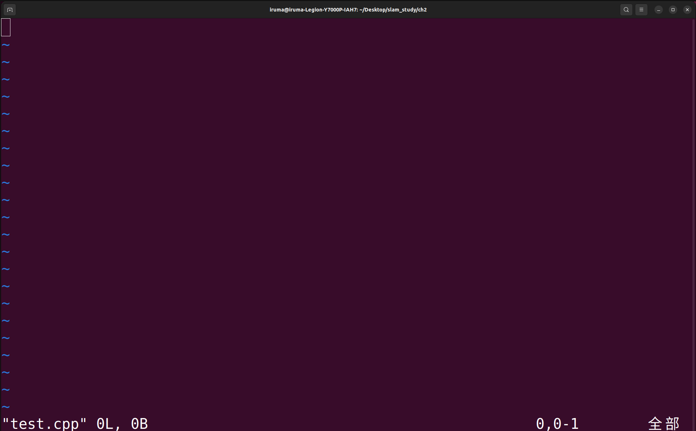
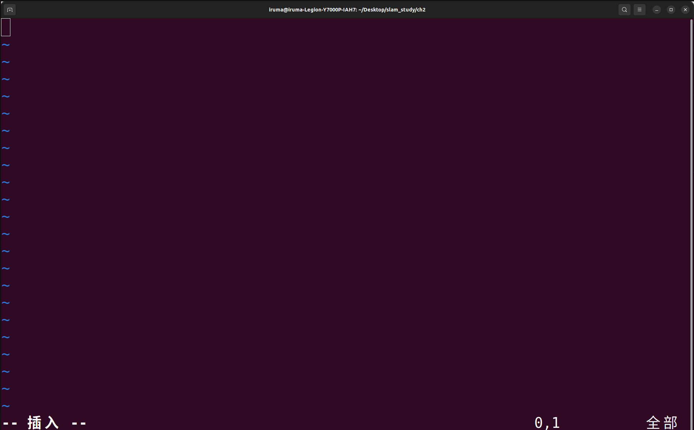
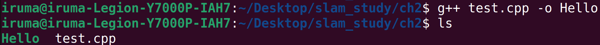
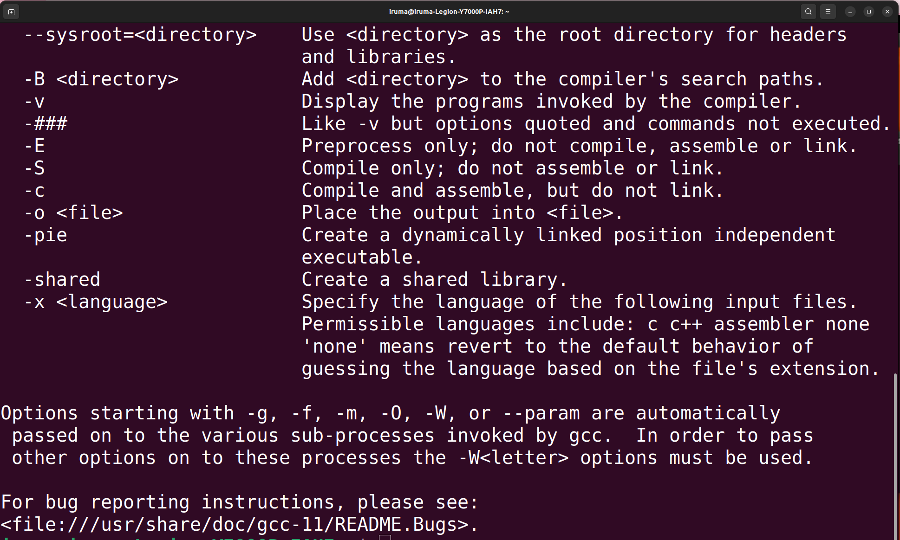
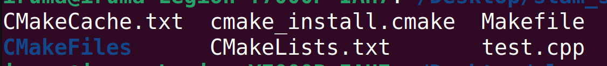
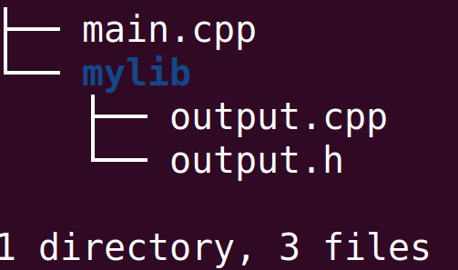

# CMake基础知识和使用方法

# 1 gcc的使用和Linux下编译C++的流程

## 1.1 gcc/g++的使用

在windows中，我们常常使用visual studio运行C/C++程序代码，只需要按下ctrl+F5即可运行。但是，作为一个新的系统，Linux和微软是死对头一般的存在，因此Visual Studio是不提供Linux版本的。为了能够利用号Linux系统的优良特性，gcc/g++和CMake两大工具就应运而生了。它们可以实现输入一些简单的命令行编译C/C++程序。

这里首先介绍一下gcc/g++的使用方法，并让大家熟悉以下在Linux系统下编译C/C++程序的流程。

### (1)创建文件
假如你的电脑没有VScode，那么创建一个.c/cpp文件需要使用touch，vim等命令。首先使用下面命令创建并且转到相应文件夹：

    mkdir test
    cd test

mkdir是创建文件夹的指令，在Linux下打开终端后使用此命令，即可在对应的路径下创建test文件夹。cd是修改终端运行路径的指令。

后运行下面指令在test下新建和编辑文件：

    touch test.cpp
    vim test.cpp

touch是创建新文件的命令，vim是在终端窗口编辑文件的命令。如果你的电脑下载了vscode，vim可以使用code代替。

打开vim后界面如下所示：

文件中的～表示这一行没有任何东西。下面会有文件的文件名，行数，存储内存的信息，若你此时按下了键盘的i键，你会发现界面变成了如下图所示的图案：

最后一行变成了插入，这种模式叫做编辑模式，只有处于编辑模式下，你才可以在文件中输入内容。如果输入完，想要推出进行保存，需要按下esc键，并输入：wq，即可完成保存。这里我就现输入常规的hello,world代码。

如果你想要查看文件的内容，可以使用cat指令查看，具体如下：

    cat test.cpp

此时文件的内容会在终端显示出来。

关于vim的更多细节，可以参考下面的链接：https://www.runoob.com/linux/linux-vim.html 。

### (2)使用gcc/g++编译文件

写完代码后，接下来要做的事情就是编译了。如果对于单独的文件或者数量较少的文件，你可以直接使用gcc(针对C语言)或g++(针对C++)工具编译。具体格式如下：

    gcc/g++ 你需要编译的文件名 -o 生成的可执行文件名
    eg:
    g++ test.cpp -o Hello

此时使用ls查看，你会发现目录下多了一个绿色的东西，名称为Hello，这个文件就是Linux下的可执行文件，相当于windows中的.exe文件。

然后在命令行中把可执行文件的路径输入进去，就可以运行输出Hello，world了。

注意：./的含义为在当前文件夹下。

## 1.2 C/C++文件在Linux下整个的编译流程

在了解之前，我们首先看一下gcc/g++的帮助文档。

可以看到有only compile, compile but not link一类的字样，说明和windows一样，使用gcc/g++编译的时候也是有一定流程将其一步一步转化的。

在windows中，编译cpp程序的步骤为：.cpp--->.obj--->.exe。linux中分为四个步骤，按照顺序，在gcc/g++中分别对应 -E，-S，-c，gcc/g++连接三个后缀和一个连接指令，依次编译生成.i(预处理后的文件)、.s(编译后产生的文件)、.o(编译整合后产生的文件)、.out(可执行文件)，后缀-o是用来修改生成文件的名称的。

例如：

    g++ -E test.cpp -o Hello   生成Hello.i文件
    g++ -S Hello.i -o Hello    生成Hello.s文件
    g++ -c Hello.s -o Hello    生成Hello.o文件
    g++ Hello.o Hello          生成Hello.out，如果你用ls查看会发现是一个绿色的文件

但是如果你的源文件非常多，你使用gcc/g++工具，只能一路.cpp，就修改一次你就要输入一次，非常麻烦，这时就需要使用工具CMake了。

# 2 CMake的使用

## 2.1 MakeFile和CMakeList

MakeFile和CMakeList可以近似地理解为程序编译的说明文档。写好一个编译文档后，你在Linux系统的命令行中，只要使用一个make指令，就可以对所有的.c/.cpp文件进行编译运行了，效果与前面的gcc/g++，后面跟了一大堆.c/.cpp相同。维护的时候，只需要修改对应的编译文档即可，较为简便。但是二者也有不同之处。

MakeFile是CMakeList编译后产生的产物，也是系统编译的时候make指令直接运行的文件，可以手写，但是不同的系统下写法不同，比如，你在Linux下是一种写法，在Windows下就是另一种写法，会给开发造成不便，因此不太推荐使用，除非你是某个系统的忠实粉丝。CMakeList具有统一的语法格式，一个CMakeList在不同的系统下，只要有CMake，都可以运行起来。教程的后续都会围绕CMakeList进行展开说明。

## 2.2 只有一个文件时CMakeList的写法

### (1)创建CMakeList
创建一个CMakeList。CMakeList的格式一般为.txt，如果你的电脑上有VSCode，可以直接在VSCode上创建。没有的话可以使用指令touch或指令vi进行创建。这里展示使用touch创建的方法，使用和上面相同的指令：

    touch CMakeLists.txt
    vim CMakeLists.txt

名字比较长，在vim那一行，你可以使用Tab键自动补全文件名。注意：文件名一定要是CMakeLists.txt，s不可以省略！！！

### (2)CMakeList的书写

由于CMakeList的语法较杂，因此在后面的部分中会进行简单的介绍，在第三部分会对语法进行一个总结。

首先，一般的CMakeList的第一行都会指定要求最低版本要求，以避免有功能无法运行的情况。具体格式如下：

    CMAKE_MINIMUM_REQUIRED(VERSION 版本号 错误信息)

含义为：前面的<code>CMAKE_MINIMUM_REQUIRED</code>是固定的指令，表示所需最低版本号，特别注意，要全部大写！！！VERSION也是固定的，后面跟随的是你需要的最低版本，错误信息可有可无，表示如果我的CMake版本低于当前版本，那么系统在编译的时候会报什么错误。

CMakeList的第二行一般为指定工程名称。格式如下：

    PROJECT(工程名 使用的语言)

使用的语言只支持C、C++和java，C++要用CXX表示，什么也不写默认为C++。

然后添加可执行文件及其对应的依赖。可执行文件就是前面我说的.out或这ls查看后那个绿色的文件。依赖的意思是，我的可执行文件是通过什么头文件编译出来的。比如前面的命令：g++ main.cpp，产生了main.out，我们就称main.cpp是main.out的依赖文件。具体的命令格式如下：

ADD_EXECUTABLE(可执行文件名称 依赖文件名称)

如果你是单独的一个文件编译，那么到这里你就写完啦。之后使用cmake工具编译当前目录即可，具体的命令格式如下：

    cmake ./

如果没有错误编译成功后，你会发现所在的文件夹下多了一些文件，如下图所示：

    

你会发现多了MakeFile文件，说明我们可以编译了，然后再输入命令<code>make</code>，就可以编译生成可执行文件了。

我的CMakeLists.txt的代码如下所示：

    CMAKE_MINIMUM_REQUIRED(VERSION 3.0)
    PROJECT(test_01 CXX)
    ADD_EXECUTABLE(test_02 test.cpp)

在编译后，你会发现，产生的可执行文件名叫做test_02，test_01找不到踪迹，说明工程名是无关紧要的，重要的是可执行文件名称。所以，往往编译者更加倾向于把工程名、可执行文件名统一命名。

相信此时你已经对CMakeLists的写法和编译步骤有了一定的了解，但是我们实际编程的时候不一定只有这一种情况，所有的代码都乖乖呆在main.cpp里面，因此后面介绍的操作就是针对不同情况的。

## 2.3 单目录多文件的CMake使用方法

### (1)单目录多文件的情形

单目录多文件指的是你的目录只有一个，但是内部有很多的.cpp和.h/.hpp文件的情况。如果你的目录下存了文件夹，而你把源文件和头文件放到了文件夹下，是不适用于这种情况的。这里面我以一个目录下面只有main.cpp，output.cpp，output.h的情况举例。具体可以看我的源代码链接。

### (2)CMakeLists的写法

一种简单的写法是：仿照2.1中的情形，你把所有的.cpp文件写到ADD_EXECUTABLE中，如下所示：

    CMAKE_MINIMUM_REQUIRED(VERSION 3.0)
    PROJECT(main_02 CXX)
    ADD_EXECUTABLE(main_02 main.cpp output.cpp)

然后按照上面的方法直接编译，亲测，不会出错！！！但是这样有个缺点，要是你的目录下头文件非常多，就会非常尴尬，后面就要一长串子，因此，需要一个简便方法，我们不想把那么多文件一一列出来，而是希望把它们不要列出。这里CMake给我们提供了这样的命令，格式如下：

    AUX_SOURCE_DIRECTORY(路径 变量名称)

看起来是不是非常怪异？这是第一个非常具有CMake风格的命令。CMakeLists中，我可以把命令的参数大致分为2个类别，一个是编译后确实有相应的文件产生的参数或有实实在在文件的参数，一类是”变量参数“，变量参数并不会在编译后产生文件，只是作为中间变量后续参与编译运算中，在后面使用这些变量时，需要使用<code>${变量名}</code>使用，后面会给出具体例子。上面的命令的意思就是，把指定路径下的所有源文件添加到后面的变量中。比如：

    AUX_SOURCE_DIRECTORY(./ SRC)

就是把当前路径下的所有源文件添加到SRC变量中，以列表形式储存。之后在编译时，只需要把前面的2个.cpp改为${SRC}就行了。完整的CMakeLists.txt代码如下所示：

    CMAKE_MINIMUM_REQUIRED(VERSION 3.0)
    PROJECT(main_02)
    AUX_SOURCE_DIRECTORY(./ main)
    ADD_EXECUTABLE(main_02 ${main})

## 2.4 多文件多目录情形下CMake的使用

### (1)多文件多目录的情形

和前面的单目录多文件对应，多文件多目录的情形是一个文件夹下有多个文件夹的情况，如下所示：

在这个项目里面，除了main.cpp，还有一个mylib文件夹，符合前面所说的多文件多目录情形。

### (2)CMake写法

<ul>
<li>写法1：在每一个目录下都建立一个CMakeLists.txt，在main中汇总

首先我们看一下子文件夹。子文件夹中的两个文件没有main函数，因此属于依赖的头文件和库文件。因此我们在给子文件夹写CMakeLists的时候，不需要写ADD_EXECUTABLE，而是要把他们以静态库/动态库的形式添加到主文件当中。让头文件和库文件生成静态/动态库的时候使用下面的指令：

    ADD_LIBRARY(库名称 STATIC或SHARED 包含的文件或文件变量)

使用这条命令我们可以加库。其中，第二个选项可有可无，如果没有，默认为SHARED，如果为STATIC，就是静态库。在windows中，静态库的后缀为.lib，动态库的后缀为.dll；在Linux中，静态库的后缀是.a，动态库的后缀是.so。
对于上面目录结构的子文件夹，可以这么写CMakeList:

    AUX_SOURCE_DIRECTORY(. SRC_DRCS)
    ADD_LIBRARY(MyLib ${SRC_DRCS})

接下来看一下顶层目录的书写。顶层目录中有main函数，因此这里就要和前面一样包括整个流程了。但是这里面，如果我们采用和之前一样的代码，系统只会把main.cpp包括进去，而把2个子目录下的头文件忽视了，非常尴尬。因此，我们首先要把子文件添加进去，使用如下命令：

    INCLUDE_DIRECTORIES(子文件目录)

此时系统会在编译的时候把子文件引入，但是不会对它们进行编译操作。而想要让子文件夹中的CMakeLists.txt发挥作用起到编译的效果，我们还需要在主文件中把子文件夹的CMakeLists和编译的库包括进去。这时需要使用如下指令：

    ADD_SUBDIRECTORY(子文件目录)
    TARGET_LINK_LIBRARIES(可执行文件名称 静态/动态库名称)

这里面坑很多，我也是被卡了一天才想明白。这里就给大家写个避坑指南。

<ul>
<li>ADD_SUBDIRECTORY和INCLUDE_DIRECTORIES缺一不可。因为二者的作用不同，不知道是因为版本原因还是其他，我看到很多网上的教程把二者混为一谈，然后在运行的时候，就给你报出奇葩错误。这里再次说明二者的作用。ADD_SUBDIRECTORY只是把子文件路径和里面的CMakeLists.txt添加了，而没有把里面的头文件、源文件内容添加，相当于告诉你，编译的时候，优先处理子文件，然后再把主文件处理了，除此以外，没有其他添加头文件的作用。INCLUDE_DIRECTORIES只负责包含头文件和源文件，但是没有把头文件和源文件编译生成库的作用，不要认为二者可以互相代替！！！亲测的结论！！！（以上文字部分摘自StackOverflow)
<li>TARGET_LINK_LIBRARIES的书写顺序，越底层的，越要写到后面，顺序不能错。
</ul>

</ul>